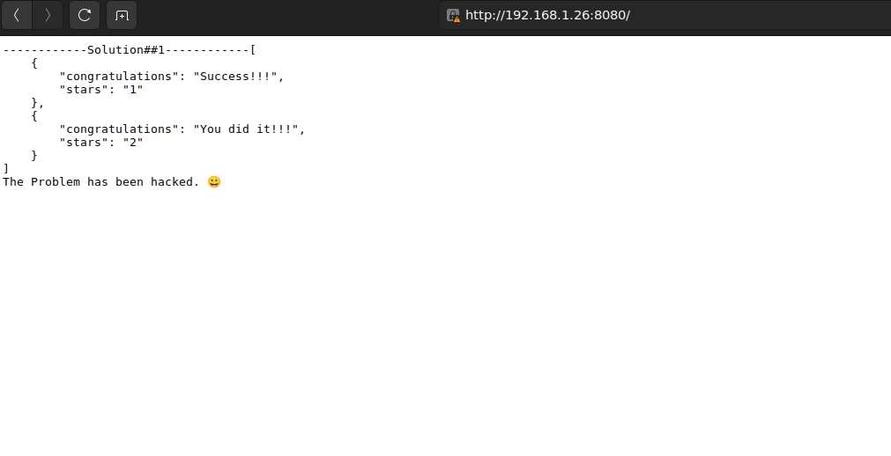

## How To Run 
### 1. Clone the github repo and cd to solution folder you wanna see or just download the solution folder and cd to that folder
```shell
git clone https://github.com/muskrt/vero-task-solution.git
cd vero-task-solution/solution-1
```
### 2. Give execute permission to launcher(dont forget to check  is python interpreter path /bin/python3 )
```shell
chmod +x launcher
```
### 3. Run the launcher and wait until you see a link on the terminal(if you choose to run compose directly wait 45 seconds for db). 
```shell
./launcher
```
### 4. Copy the link to the browser given by the Launcher like in the example.
```shell
waiting for database server....
not ready
not ready
http://192.168.1.26:8080
```
### 5. Results
<p>
  
   
</p>


